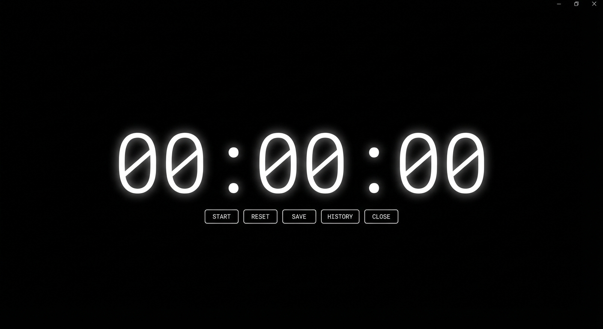
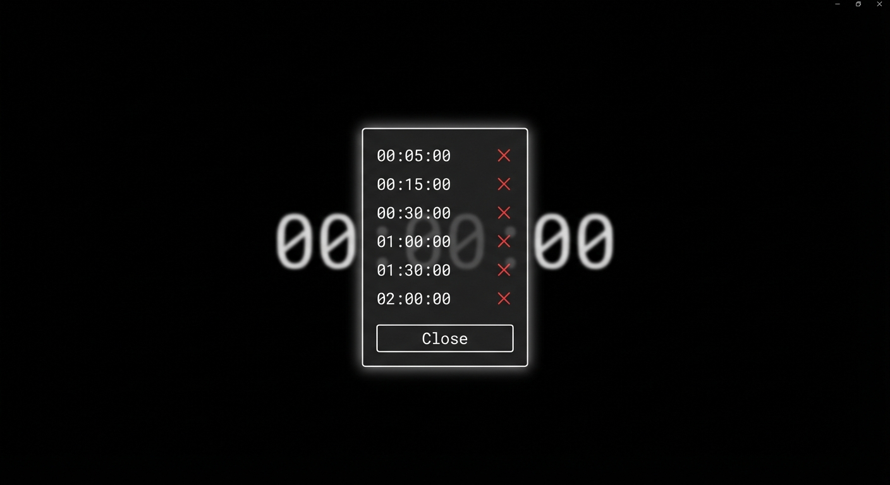

# Minimalist Countdown App

A clean, frameless countdown timer application built with Electron.

<p align="center">
  
  
</p>

## Features

*   **Minimalist Design**: Frameless window, black background, white text.
*   **Large Time Support**: Handles large durations (e.g., 500h).
*   **Granular Editing**: Click on Hours, Minutes, or Seconds to edit them directly.
*   **History**: Saves recent times manually. Delete items with a click.
*   **Responsive**: Controls hide automatically on small window sizes.
*   **Always on Top**: (Optional, can be configured in code).

## Installation

1.  Clone the repository:
    ```bash
    git clone https://github.com/yourusername/minimalist-countdown.git
    cd minimalist-countdown
    ```

2.  Install dependencies:
    ```bash
    npm install
    ```

## Usage

*   **Run in development mode**:
    ```bash
    npm start
    ```

*   **Build executable (.exe)**:
    *   **Note**: You must run your terminal as **Administrator** on Windows to avoid permission errors with symbolic links.
    ```bash
    npm run dist
    ```
    The executable will be found in the `dist` folder.

## Controls

*   **Space**: Start/Pause
*   **R**: Reset
*   **H**: Toggle History
*   **Click Time**: Edit time
*   **Hover Bottom**: Show controls

## Technologies

*   Electron
*   HTML/CSS/JavaScript
*   Electron Builder

## License

ISC
